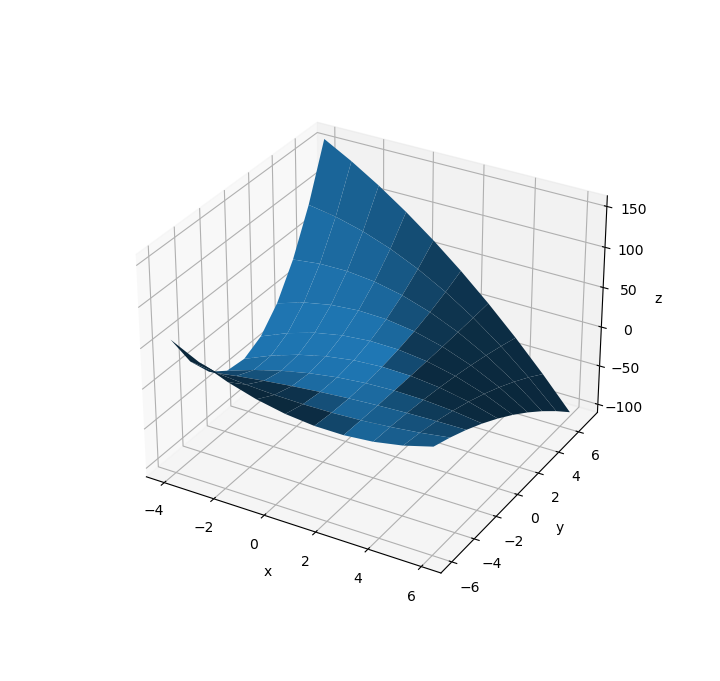
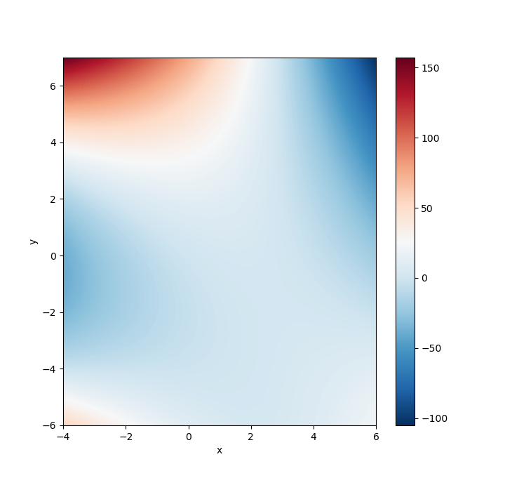

# What is it?

This package provides functionality for [bilinear interpolation](https://en.wikipedia.org/wiki/Bilinear_interpolation).
The current capabilities are the following:

- Computation of an [interpolant](https://en.wikipedia.org/wiki/Interpolation) function based on the [least sqares](https://en.wikipedia.org/wiki/Least_squares) method.

  - The interpolant is a [bilinear polynomial](https://en.wikipedia.org/wiki/Multilinear_polynomial).

  - The [degree](https://en.wikipedia.org/wiki/Degree_of_a_polynomial) of the polynomial is chosen automatically so that it would provide a perfect fit for given set of [coordinates](https://en.wikipedia.org/wiki/Coordinate_system).

- Visualisation of the [bivariate](<https://en.wikipedia.org/wiki/Function_(mathematics)#Multivariate_function>) function.

- Mathematical representation of the interpolant polynomial.

<br>

# How to install it?

```shell
pip install simple-interpolator
```

> Find out more [here](https://pypi.org/project/simple-interpolator/).

<br>

# How to use it?

The library `simple_interpolator` provides a file `interpolator` encapsulating a class `Interpolator`.

```python
from simple_interpolator.interpolator import Interpolator
```

<br>

# `Interpolator` class

|                     members                     | desription                                     |
| :---------------------------------------------: | :--------------------------------------------- |
|    [`graph()`](./docs/Interpolator/graph.md)    | three-dimentional graph of the interpolant     |
| [`colormap()`](./docs/Interpolator/colormap.md) | two-dimentional colormap of the interpolant    |
|                    `show()`                     | renders all of the visualisations              |
|                     `data`                      | a list of the provided coordinates             |
|                       `f`                       | an interpolant function                        |
| [`print_f()` ](./docs/Interpolator/print_f.md)  | mathematical representation of the interpolant |

<br>

# Example

```python
from simple_interpolator.interpolator import Interpolator

i = Interpolator([(2,-5,2),(6,-3,4),(3,-6,4),(-4,3,5),(5,-4,8),(3,7,-5)])

print("Provided coordinates:\n\n\t", i.data, "\n")

print("An interpolant:\n\n",end='\t')
i.print_f(1)

i.graph()
i.colormap()

i.show()

```

Output:

```shell
Provided coordinates:

         [(2, 5, -4), (6, 3, -4), (3, -6, 4), (4, -3, 5), (5, -4, 8)]

Generated interpolant:

        9.7+1.5x+0.4x²-0.1y-0.1xy-0.1x²y+0.2y²
```

<a href="url"></a>
<a href="url"></a>

> The spacial visualisation is provided as a rotatable 3D object. The picture presented here is just an illustration.

